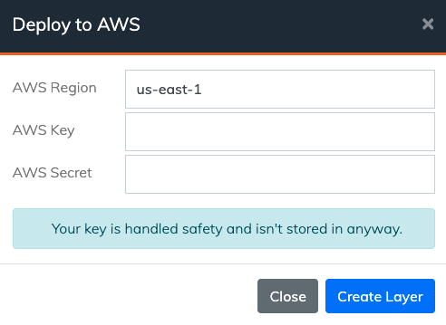

# AWS Lambda with Numpy

A demonstration project and template to deploy a AWS Lambda Function with Numpy and SciPy based on layers provided by [AWSLambdas.com](https://www.awslambdas.com).

NumPy and SciPy are popular scientific python libraries extensively used for Machine learning.   
On the other hand, the simplicity and cost-efficiency of Lambdas make it worthwhile to consider for certain use cases where Numpy and SciPy are the go-to tools.

# Prerequisite
Before you start, make sure you have installed the latest version of the [AWS CLI](https://docs.aws.amazon.com/cli/latest/userguide/install-cliv2.html)
and the [AWS Serverless Application Model (SAM)](https://docs.aws.amazon.com/serverless-application-model/latest/developerguide/serverless-sam-cli-install.html).

# Get a copy
```
git clone https://github.com/AwsLambdas/aws-lambda-numpy.git
```

# Guide

* [How to create a Numpy layer from AWS Lambdas GUI](#one)
* [How to create a Numpy layer from a zip file](#two)
* [How to create a Lambda with a Numpy layer attached](#three)

# <a name="one" id="one"></a>How to create a Numpy layer from AWS Lambdas GUI

Go to [AWSLambdas.com](https://www.awslambdas.com/layers/1/aws-lambda-numpy-scipy-python38-layer/free) and click the button "Deploy to AWS".


Enter the region, and credentials with enough permission to create a Lambda layer.



Click the button "Create Layer", and your layer will be created in a few seconds. Copy to the clipboard the returned ARN value and follow the instructions: [How to create a Lambda with a Numpy layer attached](#three)

# <a name="two" id="two"></a>How to create a Numpy layer from a zip file

Go to [AWSLambdas.com](https://www.awslambdas.com/layers/1/aws-lambda-numpy-scipy-python38-layer/free) and click the "Download" button. Then, copy the zip file to your project clone's root directory.


## Set some environment variables
To simplify the process, let's create some environment variables.
```
export AWSLL_RUNTIME=python3.8
export AWSLL_RAMDOM=$RANDOM-$RANDOM
export AWSLL_LAYER_NAME=awsll-python38-numpy1201
export AWSLL_BUCKET=awslambdas-com-$AWSLL_RAMDOM
export AWSLL_LAYER_PACKAGE=$AWSLL_LAYER_NAME.zip
```

## Create a S3 bucket
You need a bucket to store the layer's zip file.
```
aws s3 mb s3://$AWSLL_BUCKET
```

## Upload the layer package (zip)
```
aws s3 cp $AWSLL_LAYER_PACKAGE s3://$AWSLL_BUCKET/$AWSLL_LAYER_PACKAGE
```

## Create a Lambda layer
```
aws lambda publish-layer-version \
    --layer-name $AWSLL_LAYER_NAME \
    --license-info "MIT" \
    --content S3Bucket=$AWSLL_BUCKET,S3Key=$AWSLL_LAYER_PACKAGE \
    --compatible-runtimes $AWSLL_RUNTIME
```

Copy to the clipboard the value of "LayerVersionArn" from the command response and follow the instructions: [How to create a Lambda with a Numpy layer attached](#three)

# <a name="three" id="three"></a>How to create a Lambda with a Numpy layer attached

This project is a ready-to-use template to create and deploy an AWS Lambda using the [AWS Serverless Application Model (SAM)](https://aws.amazon.com/serverless/sam/).   

## Update the template file
Please, review the ***template.yaml*** file. Notice that the template will create two ressources: an API Gateway and a Lambda function.   

Replace the text "PASTE HERE YOUR LAYER ARN" with the ARN previously obtained.

## Set some environment variables
To simplify the process, let's create a couple of environment variables.
```
export AWSLL_RAMDOM=$RANDOM-$RANDOM
export AWSLL_STACK_NAME=awslambdas-lambda-numpy
```

## Create a S3 bucket
AWS SAM need this to store some information about the deployment.
```
aws s3 mb s3://$AWSLL_STACK_NAME-$AWSLL_RAMDOM
```

## Build and deploy the Lambda
The Lambda to deploy is very simple. You can see the code in the file: ***src/app.py***
```python
import json
import numpy as np

def lambda_handler(event, context):
    return {
        "statusCode": 200,
        "body": json.dumps({
            "message": "Hello Numpy!",
            "test"   : "np.array([1,2,3]).tolist()",
            "result" :  np.array([1,2,3]).tolist()
        }),
    }
```

Run the following commands to build and deploy the project to AWS:
```
sam build
sam deploy --stack-name $AWSLL_STACK_NAME --s3-bucket $AWSLL_STACK_NAME-$AWSLL_RAMDOM --capabilities CAPABILITY_IAM
```

## Test your Lambda
To test your Lambda, copy the value of the "API URL" from the previous command Outputs and you can call it with ***curl*** or just open it in a browser.
```
curl "API URL"
```

You should see the following response coming from your Lambda:
```json
{"message": "Hello Numpy!", "test": "np.array([1,2,3]).tolist()", "result": [1, 2, 3]}
```

Congratulations! You have now a base Lambda project that you can use to build on top of it.

## Clean-up
Remove the Lambda and Api Gateway
```
aws cloudformation delete-stack --stack-name $AWSLL_STACK_NAME
```

Wait a few seconds to allow the previous command to finish. Then, use the following commands to remove the s3 buckets.
```
aws s3 rb s3://$AWSLL_STACK_NAME-$AWSLL_RAMDOM --force

# If the zip file was used
aws s3 rb s3://$AWSLL_BUCKET --force
```